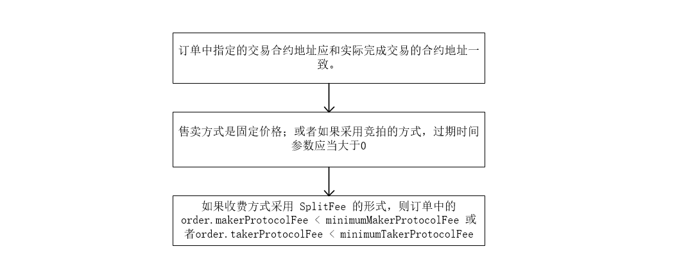
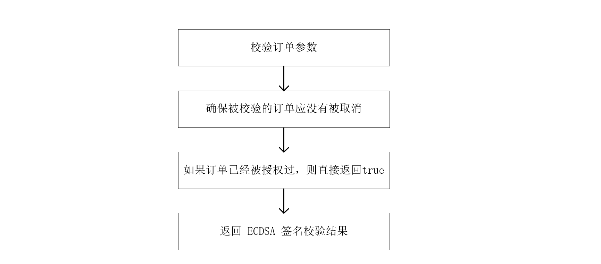
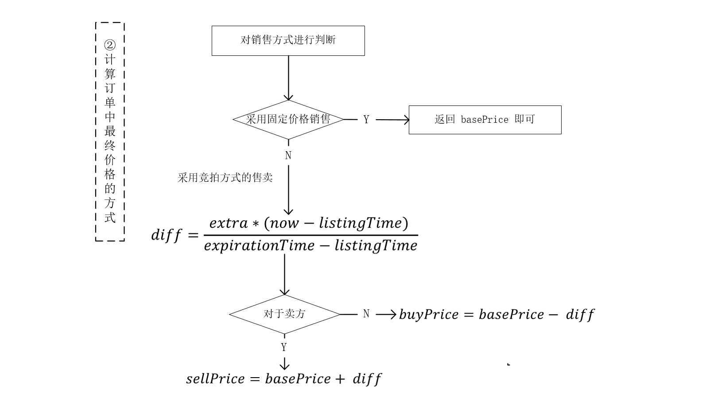
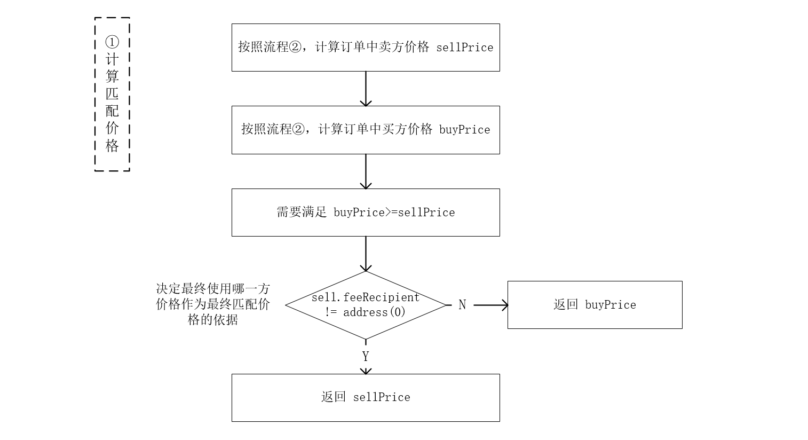
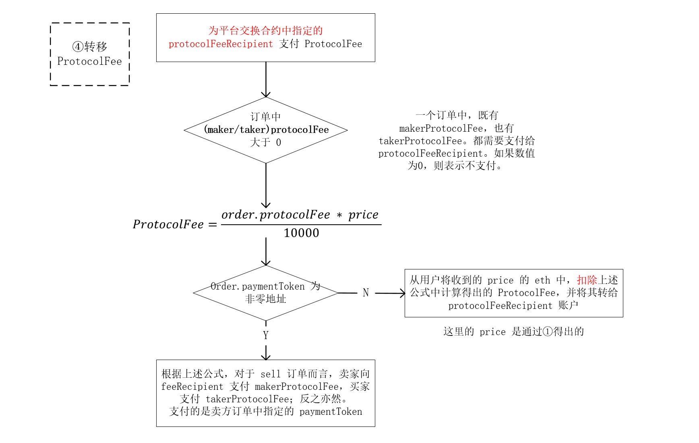
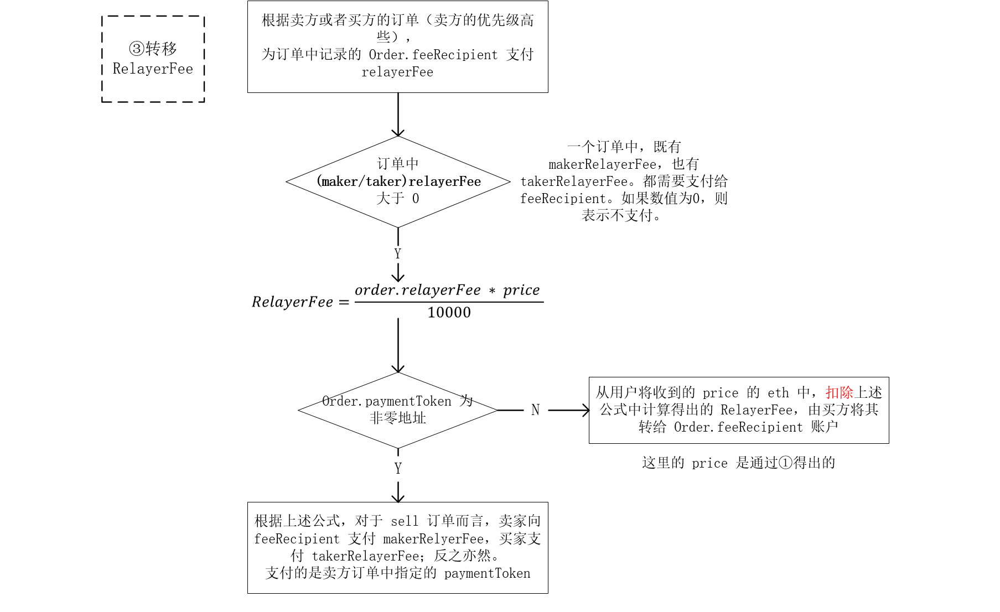
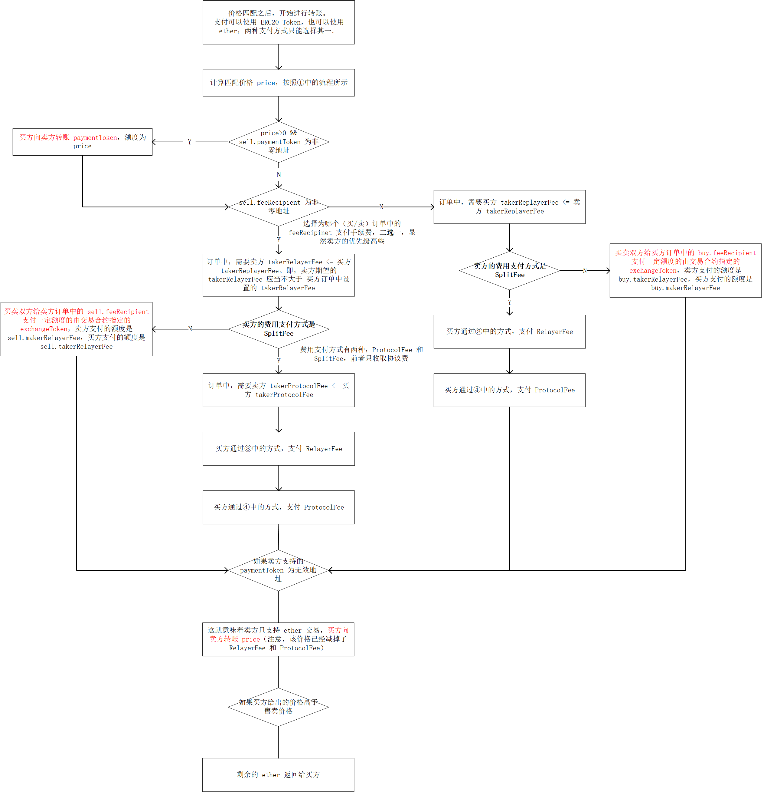
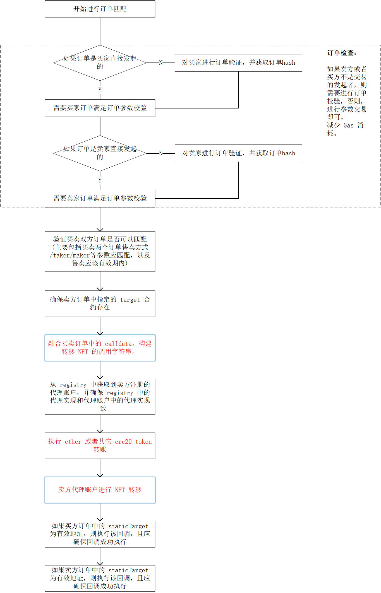

# NFT market contract

* 合约支持(ETH,ERC20,ERC721, ERC1155)
  * 销售:固定价格
    * 报价单个 NFT
    * 报价合集 NFT
  * 销售:拍卖价格
    *  英式拍卖（English Auction）
    *  维克瑞拍卖（Second-price Vickrey auction）
  * 批量购买（购物车）
  * 批量销售 NFT

* Methods of sale
  * English Auction (requires asset escrow to prevent griefing attacks)
  * Second-price Vickrey auction
* Order kinds
  * Transaction to transaction, directly without ERC20 intermediation
  * Fungible to fungible, without necessarily requiring the ERC20 spec
  * Cross-side static calls, can enforce e.g. token proportionality generically (!)
  * Proxy contract restriction - prevent function execution for escrow - upgrade by authorizing double-proxy contract with new registry
  * Completely separate order executor from order maker/taker - signed messages for proxy contracts, fees back to relayer (or market)


> 匹配订单 从买/卖双方订单开始。卖方创建销售订单，以固定价格或者竞拍的方式，将 NFT挂出去; 买方创建购买订单，并将卖方创建的销售订单一起，发给交易合约 Exchange Contract。交易合约将对订单校验，校验通过后，完成转移：
* 执行转账和支付各项手续费
* NFT产品转移

> 整体架构、订单实体、用户注册代理钱包、签名、calldata、replacementPattern 生成等 参考文档和测试用例
 
```
# install dependency
yarn

# ------------------ ------------------ ------------------ 
# localhost
# run localhost node, support MetaMask、dapp front-end 合约内已用 import "hardhat/console.sol" 进行充分打点 
npx hardhat node

# 部署合约存储在 : {networkName}.deployed.json 中
yarn env:localhost

# 测试:固定价格 『 ERC721-ETH && ERC1155-ETH && ERC721-ERC20 』
yarn test:market

# 测试:固定价格:批量 『ERC721-ETH』 
yarn test:market:wrap

# 签名 && calldata 测试
npx hardhat test
# ------------------ ------------------ ------------------ 

# goerli
手续费 ERC20 token 可自己调用 faucet 方法 获取 token
https://goerli.etherscan.io/address/0x116891E4824f3A1E95Bd5f39BADB4C907dc56592#code

测试用 ERC721 token 可自己调用 faucet 方法 获取 token
https://goerli.etherscan.io/address/0xC0Fe3203Fa908e4875dDC2757cD1C3B49a7fae1C#code

# deploy to goerli
yarn run deploy:goerli

# 测试
npx hardhat run scripts/market.js --network goerli

# ------------------ ------------------ ------------------ 


# Launchpad

yarn hardhat compile --force

yarn env:localhost:md

yarn test:md

# java hash test 

cd ./scripts/demo

./gradlew run

# ------------------ ------------------ ------------------ 

```

### 文档

   [Market设计文档](https://github.com/hoseadevops/edec-nft-market/blob/main/docs/Market%E8%AE%BE%E8%AE%A1%E6%96%87%E6%A1%A3.pdf)

   [签名 && calldata demo  js](https://github.com/hoseadevops/edec-nft-market/blob/main/test/verify.js)

   [签名 && calldata demo  solidity](https://github.com/hoseadevops/edec-nft-market/blob/main/contracts/Verify.sol)

   * 合约接口: documents/index.html
       * 可参考 contracts/NFTMarket.sol: Exchange 合约  和  contracts/NFTMarketWrap.sol合约 
       * 可参考：测试用例

### 流程图

> 买


> 卖


> 订单参数效验



> 订单合法性校验



> 最终价格 - 价格计算

```
# 图中勘误（对于拍卖）：
/* Sell-side - start price: basePrice. End price: basePrice - extra. */
/* Buye-side - start price: basePrice. End price: basePrice + extra. */
```


> 最终价格




> 费用是由卖单中的 feeMethod 指定的，收取方式有两种：

* SplitFee： 根据卖方或者买方中的订单记录（二选一），买卖双方按照卖方订单中指定的支付币种（ether 或 erc20 token）各自支付 RelayerFee 给订单指定的 FeeRecipient，由买卖双方各自支付 ProtocolFee 给交易合约（Wyvern Exchange Contract）中指定的 protocolFeeRecipient.
* ProtocolFee： 根据卖方或者买方中的订单记录，使用交易合约中指定的 exchangeToken 支付

> protocol fee



> relayer fee




> 订单匹配 - 交易转账
 



> 订单匹配 - NFT转移



    
